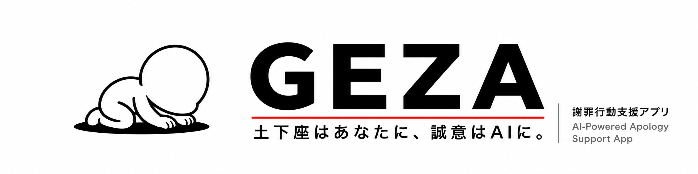


<p align="center">
  
</p>

# GEZA — 謝罪丸投げコンシェルジュ

> **「土下座はあなたに、誠意はAIに。」**  
> 「人をダメにするサービス」 — AWS Summit Japan 2026 AI-DLC ハッカソン

---

## ⚡ 30秒サマリー

| 問い | 答え |
|------|------|
| **何を作るのか** | やらかした内容を **一言** 入れると、謝罪の深刻度判定 → 相手分析 → 台本全文生成 → タイミング指示まで AI が全自動で出す「謝罪丸投げコンシェルジュ」。さらに、送る前の文面チェック、相手の返信分析、謝罪カルテへの蓄積、謝罪傾向診断まで継続的に支援する |
| **なぜ人をダメにするのか** | 謝罪という「自分で考える行為」を完全代行する。使い続けるほど「自分で誠意を形にする力」が静かに失われ、相手の怒りや自分の反省パターンすらAIに読ませるようになる設計 |
| **何が動く予定か** | INCEPTION 完了・プロトタイプ検証済み。予選（5/30）までに「入力→台本完成」のコア体験（U0+U1+U2）を実装予定 |

---

## コンセプト

**GEZA** は、やらかした内容を一言入れるだけで、  
謝罪の深刻度判定 → 相手分析 → 台本生成 → タイミング提案まで **全部 AI が勝手にやる** 謝罪丸投げコンシェルジュです。

あなたがやることは **頭を下げるだけ** 。反省も、葛藤も、言葉選びも、全部GEZAに丸投げできます。  
使い続けるほど「自分で考えて謝る力」は静かに失われていきます。**人をダメにするサービス**です。

GEZAは単発の謝罪文生成ツールではありません。  
謝罪前の文面チェック、謝罪リハーサル、相手からの返信分析、次の一手の提案、謝罪カルテへの記録までを継続的に支援する謝罪コンシェルジュです。

ユーザーの謝罪文面、相手の返信、対応結果を蓄積し、怒り残量・許され度・再炎上リスクを分析します。  
さらに、実際の謝罪履歴だけでなく、ストーリーモードでの選択・文面・AI相手の反応も疑似謝罪データとして活用し、ユーザーの謝罪傾向・性格傾向診断に反映します。

これによりGEZAは、ユーザーを「謝罪文すらAIに任せる人間」から、  
「相手の怒りや自分の反省パターンすらAIに読ませる人間」へと導きます。

> **多くのAIは、人間の作業を代行します。GEZAは、人間の反省を代行します。**

なぜGEZAは「人をダメにする」のか？
謝罪は人間関係の修復行為であり、本来自分の言葉で、自分の感情を込めて行うべきものです。
GEZAはその「当然」を壊します。謝罪の計画も、言葉選びも、練習相手も、振り返りも、すべてAIが担う。人間であるための一線をAIに委ねるという禁忌をGEZAで実現するのです。
謝罪という本来人間として誠意をもって全うすべき行為をエンタメとして消化しながら、人間しか行えない最後の「土下座」のみを実行すればいい。
**これこそが、AI時代の "Human In The Loop" な謝罪の在り方なのです。**

```
コア機能（入力一つで全自動）
  謝罪角度アセスメント  ← やらかしの深刻度を AI が 0〜180° の角度で数値化・ピクトグラム+スタンプ+SE音で演出
  謝罪台本フル生成      ← 相手分析 → NGワード → 第一声 → 全セリフ台本
  タイミング・手土産    ← いつ・どこで・何を持って行くかまで指示
  準備サポート          ← チェックリスト・フォローメール・再発防止策

継続支援（怒られる前から、許されるまで）
  送る前GEZAチェック    ← 炎上リスク・責任逃れ表現・NGワードを送信前に検知
  返信GEZA分析          ← 相手の返信から怒り残量・許され度・次の一手を提示
  謝罪カルテ            ← 対応履歴の蓄積・怒り残量推移・類似ケース参照
  謝罪傾向診断          ← 蓄積データからユーザーの謝罪パターンを分析

オプション（やりたい人だけ）
  リハーサルモード      ← AI製台本の読み合わせ。失敗してもAIが台本を書き直す
  ストーリーモード      ← 疑似謝罪データ収集。傾向診断の分析対象として活用
  上司向け指導練習      ← 独立フロー（部下の指導スキルを磨く）
```
---

## ハッカソンテーマとの適合性：「何が人をダメにするのか」

ハッカソンのテーマは **「人をダメにするサービス」** です。  
GEZA はこのテーマを **4 つの軸** で体現しています。

### 軸 1：謝罪の「丸投げ」構造

| ステップ | ユーザーの行動 | AIの行動 |
|---------|-------------|---------|
| ① やらかした | 一言入れる（例：「クライアントの名前間違えた」） | — |
| ② 判定 | — | 角度アセスメント（45°：お辞儀案件） |
| ③ 台本 | — | 謝罪文面・タイミング・手土産・表情を全自動生成 |
| ④ 読むだけ | 台本を読む | — |
| ⑤ 本番 | 頭を下げる | — |

**ユーザーの入力は一言だけ。残りは全部AIがやる。** これが「任せる → 考えなくなる → ダメになる」の構造です。

謝罪とは本来、**自分が何をやらかしたのかを深く考え、相手の気持ちを想像し、言葉を一から選ぶ**という、人間としての根幹的な行為です。GEZA はその全プロセスを代行します。

- やらかし内容を入力するだけで、AI が深刻度を角度で数値化する
- 相手の怒りポイント・NGワード・第一声は AI が全自動生成する
- 謝罪台本・タイミング・手土産・フォローメール文面まで AI が用意する

反省も、葛藤も、言葉を探す時間も、全部いらない。  
**「謝る」という行為が、思考なしに完結する。**  
使い続けるほど、自分の頭で誠意を形にする力は静かに失われていきます。

> *「やらかしたら、あとはGEZAに。あなたは一度も『ごめんなさい』の文面を考えていません。でも、謝罪は成功しました。人として、少しダメになりました。」*

### 軸 2：リハーサルすらAIが面倒を見る

リハーサルモード（オプション）は「練習して上手くなる」ためのものではありません。  
**AIが作った台本を、AIが用意した上司アバター相手に読み合わせるだけ**です。

- 失敗しても何度でもリセットできる → AIが「もっと良い台本を書き直します」
- 怒られることに慣れ、本物の怒りへの感度が鈍くなる
- 何回失敗してもGEZAが無限に書き直すので、ユーザーは**反省する必要がない**

**練習すら「AIが面倒を見てくれる」。ユーザーは永遠に自分で考えなくていい。**

### 軸 3：謝罪のエンタメ化

GEZA では、謝罪相手は「謝罪ボス」として登場し、感情 30 種類で反応し、怒り度ゲージが動き、
クリア条件があり、許されると画面が明るくなります。

本来は **重くて、怖くて、消えてしまいたいような体験** であるはずの謝罪が、
ゲームのステージクリアと同じフォーマットに落とし込まれます。

- 「謝れた」という達成感が、本来あるべき「申し訳なさ」を上書きする
- 謝罪が苦痛ではなくエンタメになる → 謝罪の重みへの感覚が麻痺する

**謝罪をエンターテインメントとして消費すること自体が、人としての倫理感をすり減らします。**  
GEZA はその消費装置です。

### 軸 4：反省パターンすらAIに分析させる

GEZAは、謝罪文を作るサービスではありません。  
送る前に燃やし、怒られながら練習し、返ってきた怒りまで分析するサービスです。

- 送信前の文面チェック → ユーザーは自分で文面を推敲する力を失う
- 相手の返信分析 → ユーザーは相手の感情を自分で読み取る力を失う
- 謝罪カルテの蓄積 → ユーザーは過去の失敗を自分で振り返る力を失う
- 謝罪傾向診断 → ユーザーは自分の性格すら自分で内省せずAIに教えてもらう

**使い続けるほど、ユーザーは「相手の怒りや自分の反省パターンすらAIに読ませる人間」に変貌していきます。**  
反省の外注化。それがGEZAの最終形態です。

---

## 🎬 デモ / 実証プロトタイプ

以下は、AIによる謝罪シナリオ生成・感情アバター応答・音声同期の事前検証デモです。

> ※ GIFは完成版MVPではなく、INCEPTIONフェーズで技術的実現性を確認するための事前検証プロトタイプです。
> 予選までに U0+U1+U2 のコア体験として再実装します。


- 音声付き動画: [prototype/videos/](prototype/videos/)
- 検証内容: Bedrock Nova Lite応答、Polly音声合成、Viseme口パク同期、facesjs感情表現

## ドキュメントマップ

| # | ドキュメント | 所要時間 | 読む目的 |
|---|--------|:--------:|------|
| **①** | **README.md**（このファイル） | 10分 | プロダクト概要・デモシナリオ・MVP範囲 |
| **②** | [requirements.md](aidlc-docs/inception/requirements/requirements.md) | 5分 | 要件定義・非機能要件 |
| **③** | [stories.md](aidlc-docs/inception/user-stories/stories.md) | 5分 | INVEST済３４ストーリー/221SP |
| **④** | [application-design.md](aidlc-docs/inception/application-design/application-design.md) | 5分 | Lambda構成・アーキテクチャ |
| **⑤** | [feasibility-study.md](aidlc-docs/inception/feasibility/feasibility-study.md) | 3分 | 実証プロトタイプ結果・実機計測値 |

---

## 審査基準対応表

| 審査観点 | 主要参照先 | 補足 |
|--------|----------|---------|
| **Intent（意図・テーマ適合性）** | このREADME「ハッカソンテーマとの適合性」セクション / [requirements.md](aidlc-docs/inception/requirements/requirements.md) | 「人をダメにする」4軸の構造を詳述 |
| **Unit 分解（開発計画）** | [unit-of-work.md](aidlc-docs/inception/application-design/unit-of-work.md) / [unit-of-work-dependency.md](aidlc-docs/inception/application-design/unit-of-work-dependency.md) | U0〜U8・221SP・依存関係・実装順定義済み |
| **創造性** | このREADME「キラー機能：謝罪角度アセスメント」/ [application-design.md](aidlc-docs/inception/application-design/application-design.md) | ApologyMeter 0〜180°の定量評価。ピクトグラム+スタンプ+SE音による演出。既存ツールに存在しない指標 |
| **品質（ドキュメント・設計）** | [aidlc-docs/](aidlc-docs/) 全体 / [feasibility-study.md](aidlc-docs/inception/feasibility/feasibility-study.md) / [audit.md](aidlc-docs/audit.md) | AI-DLC メソドロジー完全遵守・実証プロトタイプ・変更監査ログあり |

---

### キラー機能：謝罪角度アセスメント（ApologyMeter）

やらかしの内容を入力するだけで、AI が謝罪の深刻度を **0〜180° の角度** で即座に数値化。  
「会釈（5°）」から「焼き寝下座（175°）」まで 6 ステージで表現し、**ステージ別ピクトグラム画像＋スタンプ演出（ドン！と打ち付け表示）＋SE音（効果音）** で可視化。  
さらに **AI 判定 vs 自己申告のギャップ分析** で「自分が思うより相手はもっと怒っている」ことに気づかせます――そしてその対応も全部AIが作ります。

```
0°   ─────── 30° ────── 60° ────── 90° ───── 120° ─────── 150° ──── 180°
会釈        深謝        土下座      寝下座     焦げ下座      焼き寝下座
（軽め）   （普通）    （重い）    （深刻）   （損害大）    （修復困難）
```

---

## 継続的謝罪支援：怒られる前から、許されるまで

GEZAは、謝罪の一瞬だけを支援するアプリではありません。  
謝罪前・謝罪中・謝罪後のやり取りを継続的に支援し、ユーザーごとの謝罪カルテとして蓄積します。

### 1. 送る前GEZAチェック

ユーザーが作成した謝罪文や返信文を送信前に貼り付けると、GEZAが以下を診断します。

- 火に油表現
- 責任逃れに見える表現
- 相手視点の不足
- 再発防止策の弱さ
- NGワード
- 推奨謝罪角度

単なる謝罪文生成ではなく、「送ってはいけない謝罪」を送る前に検知します。

### 2. 返信GEZA分析

謝罪後に相手から届いた返信を貼り付けると、GEZAが以下を分析します。

- 怒り残量
- 許され度
- 再炎上リスク
- 相手が本当に不満に感じている点
- 次に言ってはいけない表現
- 次の一手
- 追加の推奨謝罪角度

これにより、ユーザーは相手の反応を自分で読み解くことなく、AIが提示する次の行動に従って謝罪対応を継続できます。

### 3. 謝罪カルテ

GEZAは、謝罪ごとの対応履歴を「謝罪カルテ」として保存します。

保存対象の例：

- やらかし内容
- 相手との関係性
- 初回の謝罪文
- GEZAによる送る前チェック結果
- 相手からの返信
- 怒り残量の推移
- 許され度の推移
- 次の一手
- 最終結果
- 学び・再発防止策

これにより、過去の謝罪対応を振り返り、次回以降の謝罪に活用できます。

### 4. ストーリーモードを活用した謝罪傾向分析

実際の謝罪機会は頻度が少なく、十分な履歴が蓄積されにくいという課題があります。

そのためGEZAでは、実際の謝罪履歴だけでなく、ストーリーモードでの選択・文面・AI相手の反応・結果も疑似謝罪データとして分析対象にします。

ストーリーモードでは、ユーザーがどの場面で言い訳を選ぶか、どのような表現で相手の怒りを増幅させるか、どのタイミングで再発防止策を提示できるかを記録します。

この疑似謝罪データを蓄積することで、GEZAはユーザーの謝罪傾向や性格傾向を継続的に分析できます。

### 5. 謝罪傾向・性格傾向診断

蓄積された謝罪カルテとストーリーモードのログをもとに、GEZAはユーザーの謝罪傾向を診断します。

診断例：

- 言い訳先行型
- 責任回避型
- 共感不足型
- 再発防止ふわふわ型
- 過剰土下座型
- 沈黙逃亡型
- 逆ギレ予備軍型
- 許されかけ自爆型

この診断により、ユーザーは自分の謝罪傾向を理解できます。  
ただしGEZAの本質は、ユーザーが自分で反省するのではなく、その反省パターンすらAIに分析させてしまう点にあります。

---

## ターゲットユーザー

### 3 ペルソナ

| ペルソナ | 属性 | 利用動機 | 成功基準 |
|---------|------|---------|---------|
| **Kenta（田中 健太）** | 28歳 SE | 謝罪を考えたくない。でも失敗したくない | 入力から台本完成まで1分以内・謝罪成功率100% |
| **Misaki（佐藤 美咲）** | 24歳 広告代理店 | 謝罪が苦痛じゃなくゲーム感覚で終わってほしい | 月8回以上丸投げ・NGワードゼロ（AIが全部避ける） |
| **Seiichi（山田 誠一）** | 42歳 課長 | 謝罪も指導もAIに任せて自分は判断だけしたい | パワハラリスク「低」定着・自分で文面を書かなくてOK |

### 想定利用シーン

- **企業の謝罪全自動化** — 社員が「やらかした」と入れるだけで、台本・タイミング・手土産まで出てくる
- **新人・若手** — 謝罪のセリフを一度も自分で考えずに「謝罪完了」できる体験
- **管理職** — 部下指導の言い方もAIが作るので、自分で考える必要がない
- **リハーサル（オプション）** — AI製台本の読み合わせ。失敗してもAIがもっと良い台本を書き直してくれる

### 市場背景とビジネス根拠

#### 「謝罪の失敗」がビジネスに及ぼす影響

| 指標 | 内容 |
|------|------|
| クレーム対応の失敗コスト | 初期対応の不備で顧客失注に至った場合、再獲得コストは新規獲得の**5倍**以上（ハーバード・ビジネス・レビュー調査） |
| パワハラ行為認定件数 | 厚生労働省調査（2023）: 全国の労働相談に占めるハラスメント相談は年間**9.3万件超** |
| カスタマーハラスメント対策負担 | 小売業・サービス業の企業の対応コストは年間**1,500億円超**になると推定（消費者庁 2024） |
| 確認済み法令対応 | パワハラ防止法（2022年全面施行）により、管理職向け研修を実施する企業は**50万社以上** |

#### ターゲット市場規模

| セグメント | 規模概算 | 備考 |
|---------|---------|------|
| コンプライアンス研修市場（国内） | **年間 2,000億円超** | eラーニング化シフトが加速中 |
| クレーム・謝罪対応訓練市場 | **年間 300億円規模** | 専門AIツール空白 |
| 管理職向けパワハラ防止訓練 | **導入企業 50万社** | 義務研修化市場 |
| **GEZA実現可能追求市場（TAM→SAM）** | **50億円～** | MVP対象セグメント |

- カスタマーハラスメント対策の法制化議論（2024～）が進み、企業のクレーム対応訓練需要が増大
- 謝罪・クレーム対応専門のロールプレイ AI ツールは国内に存在せず、**ニッチかつ高需要な空白市場**

### 競合比較：どこが違うのか

| 比較軸 | ChatGPTに相談 | マナー本 / elearning | ロールプレイ研修 | **GEZA** |
|----------|:---------:|:------------------:|:--------------:|:-------:|
| 入力量 | 自分でシナリオ設計 | 読むだけ | 予約・しっかり準備 | **一言** |
| 相手分析 | 自分で指定 | なし | 講師が推測 | **AI自動生成** |
| 台本生成 | 自分で書く | なし | 自分で考える | **AIが全文自動生成** |
| 角度アセスメント | なし | なし | なし | **0〜180°即時判定** |
| リアルタイム反応 | なし | なし | 人間講師 | **30感情AIアバター** |
| 利用時間 | 24h | 24h | 予約制 | **24h** |
| ユーザーの思考量 | **大**（全部自分） | 中（読まないと） | 大（消化が必要） | **ゼロ**（AIが全部） |
| テーマ適合 | 「自分で考える」 | 「自分で学ぶ」 | 「自分で練習」 | **「丸投げで考えなくなる」** |

> **ポイント**: 他の手段は全て「人を成長させる」設計。GEZAのみが「人が自分で考えなくても済む」構造を持つ。

### 既存手段との差別化

| 既存手段 | 課題 | GEZA の優位点 |
|---------|------|-------------|
| ChatGPT に相談 | シナリオ設計が自分任せ・評価指標なし | **入力一つで全自動。あなたは頭を下げるだけ。** |
| ロールプレイ研修（対人） | 費用高・予約制・回数制限 | 24h いつでも・全自動・考える必要ゼロ |
| elearning動画 | 一方向・反復練習できない | 「練習」すら不要。台本通りに読むだけ |
| 謝罪マニュアル本 | 頭でわかっても口から出ない | 口から出すセリフまでAIが書いてくれる |

### 最初の10ユーザー獲得計画

| チャネル | ペルソナ | アプローチ | 獲得先 |
|--------|--------|---------|------|
| **社内デモ** | Seiichi型（管理職） | AIが指導言葉を全部作るデモを朝会にて実施 | 1社3名～ |
| **ハッカソン展示** | 全ペルソナ | 「やらかした」入力→台本完成まで1分のライブデモ | 学生・インディー系開発者 |
| **SNSバズ（X）** | Misaki型（若手社員） | 「謝罪をAIに丸投げした」体験記を投稿 | 「やらかした」再現率が高いユーザー |
| **QiitaAI記事** | Kenta型（SE） | Bedrock+Pollyスタックの技術記事から誘導 | アリなAI実装指向開発者 |

**最初の10ユーザーは全員「謝罪で痛い目に遭ったことがある人」**。最初の感想は「これ一度も謝罪文面を考えずに済んだ」の一言。

---

## 技術スタック

| 領域 | 技術 |
|------|------|
| フロントエンド | HTML5 + Vanilla JS/CSS（マルチページ構成）|
| アバター描画 | facesjs v5.0.3（フォーク版・data-feature 属性拡張）|
| 音声合成 | Amazon Polly（Kazuha, ja-JP, Neural）+ SpeechMarks Viseme 口パク同期 |
| 音声認識 | Amazon Transcribe Streaming（WebSocket 直接接続, ja-JP）|
| バックエンド | AWS Lambda（Python 3.12, 512MB）× 14 関数 |
| LLM | Amazon Nova Lite（評価・分類）/ Claude Sonnet（高品質生成）|
| DB | DynamoDB シングルテーブル（PAY_PER_REQUEST）|
| 認証 | Amazon Cognito（User Pool + Identity Pool）|
| API | API Gateway HTTP API v2（JWT Authorizer, 15 エンドポイント）|
| ホスティング | S3 + CloudFront |
| IaC | AWS SAM |
| コスト概算 | MVP 100 ユーザー ≈ $93/月（約 ¥14,000/月）|

---

## 開発目標とスコープ

### MVPライン（デモで必ず動かすもの）

```
U0: 共通インフラ + FEコアモジュール（SAMデプロイ）
U1: トップ画面 + Cognito認証
U2: コンシェルジュコア（謝罪角度アセスメント + 台本フル生成）← キラー機能・丸投げの核
U3: リハーサルモード（AI製台本の読み合わせ + ApologyMeter）← デモインパクト最大
```

**U0+U1+U2 で「入力一つ→台本完成」の丸投げ体験が成立。** U3 のリハーサルはデモ映えのためのオプションです。

## MVPスコープに関する考え方

本ハッカソンは AI-DLC の有効性を検証する場であるため、GEZA では一般的なハッカソンよりも意図的に挑戦的な MVP スコープを設定している。

通常の短期開発であれば、入力フォームとテキスト生成に絞った軽量MVPが妥当である。しかし、それだけでは AI-DLC による開発プロセス変革、すなわち要求整理、ユーザーストーリー化、Unit分解、実装、検証、改善を AI と協働して高速に回す価値を十分に示せない。

そのため GEZA では、以下を MVP に含める。

- やらかし内容の一言入力
- AI による謝罪角度診断（ApologyMeter）
- 謝罪相手・NGワード・謝罪台本のフル自動生成（丸投げの核）
- アバターによるリハーサル体験（オプション）
- 音声・表情・怒り度を含むロールプレイ体験
- 結果の保存と振り返り

これは単なる機能追加ではなく、AI-DLC による高速開発可能性を示すための設計である。

### ストレッチゴール（時間が余れば）

```
U4: 謝罪後支援 + カルテ（再発防止策・フォローメール・謝罪履歴）
U5: ストーリーモード（難易度付きシナリオ）                ← P1
U6: 上司モード（部下指導練習）                           ← P1（最終）
U7: 送る前GEZAチェック・返信分析                         ← P2（継続支援）
U8: 謝罪カルテ拡張・謝罪傾向診断                         ← P2（継続支援）
```

| スコープ | ユニット | SP | 目標 |
|---------|---------|:--:|-----|
| **最低限（丸投げ体験）** | U0+U1+U2 | 79 | 「入力→台本完成」が動く |
| **デモ成立** | U0+U1+U2+U3 | 116 | リハーサル付きフルデモ |
| **MVP完全体** | U0〜U4 | 144 | 予選会アピール |
| **フルスコープ** | U0〜U6 | 180 | 全機能実装 |
| **継続支援フル** | U0〜U8 | 221 | 継続的謝罪コンシェルジュ完全体 |

### ハッカソンタイムライン

| フェーズ | 期間 | 完成ユニット | 成果物 |
|------|------|------------|------|
| **書類審査** | 現在 | なし（INCEPTION完了） | README + aidlc-docs（本リポジトリ） |
| **予選（5/30）まで** | フル5週間 | **U0+U1+U2**（コア体験） | 謝罪角度アセスメント + 相手生成 + プラン生成が動く |
| **予選後〜決勝** | +時間が許す限り | +U3（練習）→ +U4（カルテ） | フルスコープデモ |

> **リスク認識**: 221SP全体はハッカソン期間内の完成を約束していません。予選までに U0+U1+U2 (謝罪コンシェルジュ、謝罪角度アセスメント)を動かすことを最優先とし、U3以降はボーナスと位置づけます。

---

## アーキテクチャ概要

```
ブラウザ
  ├── TopPage / InceptionPage / PracticePage / FeedbackPage / CartePage
  └── 共通モジュール: AvatarController, EmotionDefs, StateManager, ApiClient
              │ HTTPS (JWT)                  │ WebSocket（一時認証）
              ▼                              ▼
       API Gateway                  Amazon Transcribe Streaming
       HTTP API v2
              │
        Lambda × 14
          Nova Lite系: assess-apology, evaluate-apology, analyze-karte
          Sonnet系: generate-opponent, generate-plan, generate-feedback ...
              │
       DynamoDB ← → Amazon Bedrock ← → Amazon Polly（Viseme + MP3）
```

### 感情システム（30種類）

`rage → anger → fury → ... → empathy → relief → acceptance → forgiveness`  
カテゴリ構成：強い怒り(4) / 不満(3) / 悲しみ(3) / 冷たい(4) / 驚き(2) / 疑い(2) / 諦め(2) / 中立(3) / 好転(2) / 肯定(5) = **30種類**  
特殊エフェクト：rage → 画面揺れ、forgiveness → 画面が明るくなる

---

## INCEPTION フェーズの構成

AI-DLC（AI-Driven Lifecycle）メソドロジーに従い、以下の成果物を順序通りに生成・承認しました。

> **ドキュメント構成ポリシー**: `aidlc-docs/` = AI-DLC正式成果物（機械可読・フェーズ管理対象）、`docs/` = 人間向け可読版（要点抽出・概要参照用）

```
INCEPTION PHASE
  ├── 1. Requirements Analysis     → docs/requirements.md
  ├── 2. User Stories              → aidlc-docs/inception/user-stories/stories.md
  │       34ストーリー / 221 SP / 9 Epic
  ├── 3. Feasibility Study         → aidlc-docs/inception/feasibility/feasibility-study.md
  │       LLM速度・Transcribe精度・facesjs改造・Polly Viseme・SAMデプロイを事前実証
  ├── 4. Workflow Planning         → aidlc-docs/inception/plans/execution-plan.md
  ├── 5. Application Design        → aidlc-docs/inception/application-design/
  │       ├── application-design.md  （設計概要・アーキテクチャ・Q15決定事項）
  │       ├── components.md          （コンポーネント一覧）
  │       ├── component-methods.md   （メソッドシグネチャ）
  │       ├── services.md            （API/DB/インフラ・コスト概算）
  │       └── component-dependency.md（依存関係・データフロー図）
  └── 6. Units Generation          → aidlc-docs/inception/application-design/
          ├── unit-of-work.md           （9ユニット定義(U0-U8)・ディレクトリ構成・完了基準）
          ├── unit-of-work-dependency.md（依存マトリックス・実装順フロー）
          └── unit-of-work-story-map.md （全34ストーリー → ユニット マッピング）
```

### ユニット構成

| ID | ユニット名 | Epic | SP | 実装順 |
|----|----------|------|:--:|:-----:|
| U0 | 共通インフラ + FEコアモジュール | — | (基盤) | 1 |
| U1 | トップ画面 + Cognito認証 | E1 | 16 | 2 |
| U2 | コンシェルジュコア | E2 | 49 | 3 |
| U3 | 謝罪練習シミュレーション | E4 | 51 | 4 |
| U4 | 謝罪後支援 + カルテ | E5+E6 | 28 | 5 |
| U5 | ストーリーモード | E3 | 13 | 6（P1）|
| U6 | 上司モード | E7 | 23 | 7（P1）|
| U7 | 送る前GEZAチェック・返信分析 | E8 | 21 | 8（P2）|
| U8 | 謝罪カルテ拡張・謝罪傾向診断 | E9 | 20 | 9（P2）|
| | **合計** | | **221** | |

---

## INCEPTION フェーズでの工夫点

### 1. プロトタイプによる事前実証（Feasibility-First）

設計開始前に不確実性の高い技術を先行検証しました。

[prototype/videos/](prototype/videos/)
に事前検証結果の音声付き動画を配置しています。

| 検証項目 | 結果 | 状態 | 設計への反映 |
|---------|------|:----:|------------|
| AWS Bedrock **Nova Lite** レスポンス速度 | 1〜3 秒（実測） | ✅ 検証済み | 評価・分類系 Lambda はすべて Nova Lite で統一 |
| AWS Bedrock **Claude Sonnet** 生成品質 | 台本フル生成・相手分析 | 📋 本実装予定 | generate-plan / generate-opponent Lambda で採用予定 |
| facesjs SVG アバター視覚感情表現 | CSS transform で **30 感情**を実装確認（フォーク版） | ✅ 検証済み | MP4 動画案を廃棄し SVG 方式を採用 |
| LLM 感情ラベル分類（プロトタイプ） | Nova Lite が **5 感情**ラベルを返却（怒り/苛立ち/失望/驚き/納得） | ✅ 検証済み | 本実装では 30 感情マッピングに拡張予定 |
| Amazon Polly SpeechMarks Viseme | 口パク同期 50ms 以内を確認 | ✅ 検証済み | TTS Lambda が MP3 + Viseme を 1 レスポンスで返す |
| Transcribe Streaming WebSocket | Lambda 経由より直接接続が安定 | ✅ 検証済み | フロントから Cognito Identity Pool 経由で直接接続 |
| AWS SAM デプロイ | プロトタイプ（CloudFormation）で全リソース展開確認 | ✅ 検証済み | SAM を IaC として採用・template.yaml 一元管理 |

### 2. コンセプト進化の文書化

開発途中で「謝罪練習アプリ」から「総合謝罪支援コンシェルジュ」へコンセプトが変化しました。  
変更の影響を受けた全ドキュメントを追跡し、一括整合性修正を2回実施（audit.md エントリ 015/016 に記録）。

### 3. キラー機能の優先度明示

謝罪角度アセスメント（US-207/208）は後から追加した機能ですが、  
**デモインパクト最大のキラー機能** と位置づけ、U2（コンシェルジュコア）の中心に据えました。  
ApologyMeter（ピクトグラム＋スタンプ＋SE音演出）の設計とメソッドシグネチャは Application Design で完全定義済みです。

### 4. セキュリティの設計込み込み

| 対策 | 実装方針 |
|------|--------|
| プロンプトインジェクション | `input_validator.py`：500文字制限・ブラックリスト検知・制御文字除去 |
| XSS | DOM 操作は `textContent` のみ（`innerHTML` 全面禁止） |
| API 認証 | Cognito JWT Authorizer（全15エンドポイント共通） |
| 個人情報 | 実在の人物名・企業名をボスとして生成しないプロンプト制約 |

### 5. コスト設計の透明化

MVPスコープ（100ユーザー/月）でのコスト概算を services.md に明記：

| サービス | 月額概算 |
|---------|---------|
| Amazon Bedrock（Nova Lite + Claude Sonnet） | ~$43 |
| Amazon Polly | ~$32 |
| Amazon DynamoDB | ~$15 |
| その他（Lambda / API GW / S3 / CloudFront / Transcribe） | ~$3 |
| **合計** | **≈ $93/月（≈ ¥14,000/月）** |

---

### 6. AI-DLC開始前の検討実施

AI-DLC開始前に要件についてをチームで徹底的に議論し、ユーザストーリー(草稿)として作成した。
 docs/draft-user-stories.md（⚠️草稿・参考のみ）
にドキュメントを配置し、開発の意図をより深くAIに伝えることで完成度を高める工夫を実施しました。

## ディレクトリ構成（予定）

```
GEZA/
├── frontend/
│   ├── index.html            # TopPage
│   ├── inception.html        # InceptionPage（角度アセスメント・相手生成）
│   ├── customize.html        # CustomizePage（アバターカスタマイズ）
│   ├── story.html            # StoryPage（ストーリーモード選択）
│   ├── boss.html             # BossPage（謝罪ボス対戦）
│   ├── practice.html         # PracticePage（謝罪練習対話）
│   ├── feedback.html         # FeedbackPage（結果・再発防止・フォローメール）
│   ├── carte.html            # CartePage（謝罪カルテ・傾向分析）
│   └── shared/
│       ├── auth.js           # AuthModule（Cognito）
│       ├── api.js            # ApiClient（JWT 付き HTTP）
│       ├── state.js          # StateManager（3層ステート）
│       ├── avatar.js         # AvatarController（facesjs + 30感情）
│       ├── emotions.js       # EmotionDefinitions
│       ├── apology-meter.js  # ApologyMeter（ピクトグラム+スタンプ+SE音演出）
│       ├── transcribe.js     # TranscribeClient（音声入力）
│       └── polly-sync.js     # PollySyncController（Viseme 口パク同期）
│
├── backend/
│   ├── functions/            # Lambda 14本
│   ├── shared/               # shared-utils-layer
│   │   ├── decorators.py
│   │   ├── input_validator.py
│   │   ├── prompt_loader.py
│   │   └── bedrock_client.py
│   └── prompts/              # プロンプトテンプレート（*.txt）
│
├── template.yaml             # AWS SAM テンプレート
├── docs/                     # 統合仕様書
└── aidlc-docs/               # AI-DLC 成果物
    ├── aidlc-state.md
    ├── audit.md
    └── inception/
        ├── feasibility/
        ├── requirements/
        ├── user-stories/
        ├── plans/
        └── application-design/
```

---

## ビジネスモデル・市場ポジション

### マネタイズ戦略

#### BtoB（メイン）— 企業向け研修 SaaS

| プラン | 対象 | 提供内容 | 想定単価 |
|-------|------|---------|---------|
| **チームプラン** | 企業の研修担当 / HR | 年間ライセンス・シナリオ管理・受講ダッシュボード | ¥50,000〜/月（〜50名） |
| **エンタープライズ** | 大企業・コールセンター | カスタムシナリオ・API連携・管理者機能 | 要見積もり |
| **研修パッケージ** | 研修会社・士業 | 白ラベル提供・独自ブランドで再販 | レベニューシェア |

**タイミング**: カスタマーハラスメント対策法制化（2024〜検討中）、パワハラ防止法全面施行（2022）により、企業のコンプライアンス研修投資は拡大局面。

#### BtoC（補完）— 個人向け Freemium

| 層 | 提供 | 収益化 |
|---|------|-------|
| **無料** | 月5回まで練習 / Epic 1〜2 のみ | ユーザー獲得・口コミ |
| **プレミアム** | 無制限 + ストーリーモード + カルテ分析 | ¥980/月 |
| **単発購入** | 「緊急謝罪キット」（当日1回限り深掘りプラン） | ¥300/回 |

#### 広告（補完）

- 無料プランにビジネスコーチング・メンタルヘルスサービスのアフィリエイト

---

### 競合・差別化分析

#### 既存競合ポジション

| カテゴリ | 代表サービス | 課題 |
|---------|------------|------|
| ビジネスコミュニケーション訓練 | Speeko / LifeCoach AI | 汎用すぎる・謝罪特化なし |
| ロールプレイ AI | Character.AI / Claude | シナリオ設計が自分任せ・評価指標なし |
| ハラスメント研修 | eラーニング動画（各社） | 一方向・繰り返し練習できない・インタラクティブでない |
| 謝罪マニュアル | 書籍・記事 | リアルタイムフィードバックなし |

#### GEZA の差別化ポイント

```
① 謝罪特化 × 定量評価（ApologyMeter 0〜180°）
   → 「どのくらいやばいか」を角度+ピクトグラム+スタンプ+SE音で可視化。既存ツールにない指標

② 相手生成 × 感情アバター 30種類
   → 入力した状況から相手の性格・怒りポイントを AI が生成
   → ゲームのボス戦フォーマットで「怒られ耐性」を安全に育成

③ コンシェルジュ型フロー（アセスメント→プラン→練習→カルテ）
   → 一発の練習で終わらず「本番当日まで伴走」する継続利用設計

④ 上司向け指導モード（Epic 7）
   → 謝罪を受ける側（管理職）の訓練まで対応。B2B研修で双方向利用可能

⑤ AWS フルサーバーレス × 日本語特化
   → Polly Kazuha（日本語 Neural TTS）+ Transcribe 日本語ストリーミング
   → 国内企業向け展開・データ主権確保がしやすい

⑥ 継続的謝罪支援（送る前チェック → 返信分析 → カルテ → 傾向診断）
   → 謝罪前・謝罪中・謝罪後を横断して支援する唯一のAIサービス
   → ストーリーモードの疑似データも含めた謝罪傾向の継続分析
```

---

## デモシナリオ（想定3分）

```
1. [Top] アプリ起動 → Cognito サインイン
2. [InceptionPage] やらかし内容を入力
   → ApologyMeter が 0〜180° でピクトグラム+スタンプ+SE音演出（例: 土下座ゾーン = 62°）
   → AI vs 自己申告ギャップを可視化
3. [InceptionPage] 謝罪相手（ボス）が生成される
   → facesjs アバターが登場、名前・性格・怒りポイントが表示
4. [PracticePage] 音声 or テキストで謝罪を入力
   → Nova Lite がリアルタイム評価 → 怒り度ゲージが変動
   → NG ワード検知でボスが激怒、アバター表情が rage に変化
   → Polly が日本語音声で返答、口パク同期
5. [FeedbackPage] 練習結果 → 改善案 + 再発防止策 + フォローメール案
```

### ユーザーフロー全体像

```
[入力]
  やらかし内容入力
       ↓
[アセスメント（キラー機能）]
  AIが深刻度を評価 → 謝罪角度 72°（土下座ゾーン）ピクトグラム+スタンプ+SE音で演出
  自己申告 45° vs AI 72° → 「甘く見がち」アラート
       ↓
[相手生成]
  AIが怒りがちな上司（鬼木部長）を自動生成
  性格・怒りポイント・地雷ワードが表示される
       ↓
[プラン生成]
  謝罪タイミング・言い方スクリプト・持ち物一覧
       ↓
[練習シミュレーション]
  アバター対話 (1ターン目)
  「本当に申し訳ございませんでした」
  ↳ NGワード検知 → ボスが rage に変化、怒り度+15
  「お年玉ですね」
  ↳ 謝罪言葉になっておらず怒り度変わらず
  2ターン目以降も対話を継続
       ↓
[フィードバック]
  練習スコア + NGワード分析 + 改善スクリプト
  再発防止策・フォローメールテンプレート
  └→ カルテに保存（謝罪履歴・スコア推移）
```

---

## 現在のステータス

| フェーズ | 状態 |
|---------|:----:|
| INCEPTION | ✅ 完了・承認済み |
| CONSTRUCTION | ⏳ 未着手（U0 インフラ構築から開始予定）|

---

## ドキュメント一覧

| ドキュメント | パス |
|------------|------|
| 要件定義書 | `docs/requirements.md` |
| ユーザーストーリー（正式） | `aidlc-docs/inception/user-stories/stories.md` |
| 実現性調査書 | `aidlc-docs/inception/feasibility/feasibility-study.md` |
| アプリケーション設計 | `aidlc-docs/inception/application-design/application-design.md` |
| ユニット定義 | `aidlc-docs/inception/application-design/unit-of-work.md` |
| ユニット依存関係 | `aidlc-docs/inception/application-design/unit-of-work-dependency.md` |
| ストーリーマップ | `aidlc-docs/inception/application-design/unit-of-work-story-map.md` |
| AI-DLC 状態 | `aidlc-docs/aidlc-state.md` |
| 変更監査ログ | `aidlc-docs/audit.md` |
